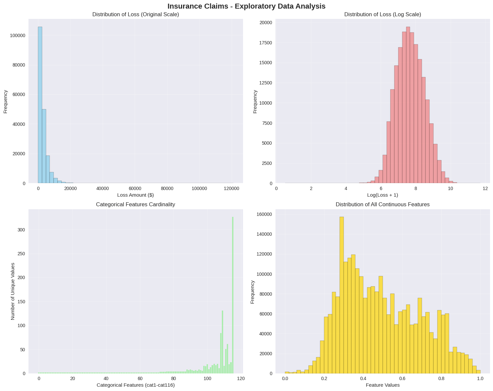
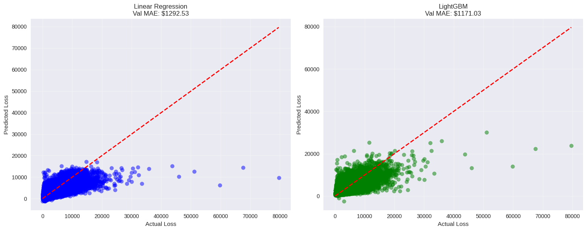
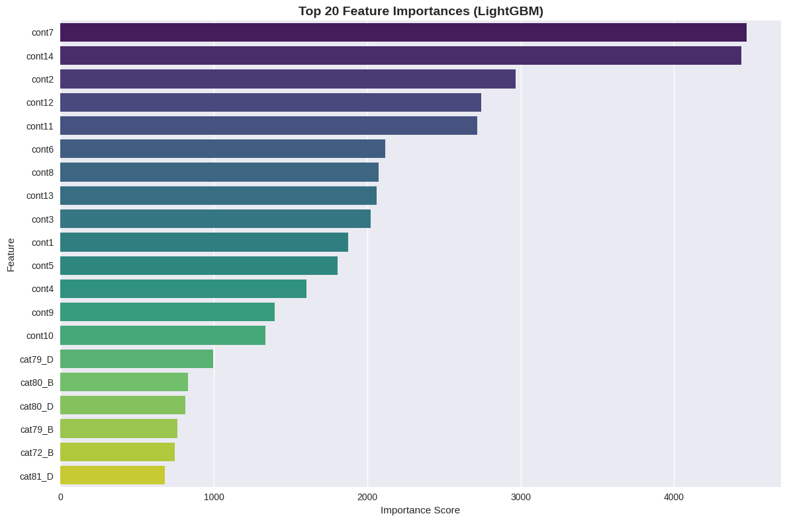
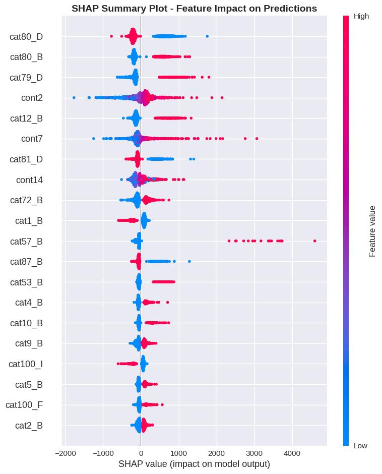

# Gradient Boosted Insurance Severity Model

This project models insurance claim severity using gradient boosting techniques. Based on the Allstate Claims Severity dataset, the project demonstrates how advanced models like LightGBM can significantly outperform traditional linear models for predicting continuous target variables.
[](https://colab.research.google.com/github/Sama-Borhani/insurance-claim-severity-ml/blob/main/notebooks/Gradient_Boosted_Insurance_Severity_Model.ipynb)

---

## Table of Contents

- [Project Overview](#project-overview)
- [Features](#features)
- [Installation](#installation)
- [Usage](#usage)
- [Evaluation](#evaluation)
- [Feature Importance](#feature-importance)
- [Interpretability (SHAP)](#interpretability-shap)
- [Dependencies](#dependencies)
- [Repository Structure](#repository-structure)
- [Contributors](#contributors)
- [License](#license)

---

## Project Overview

- **Dataset:** [Allstate Claims Severity](https://www.kaggle.com/c/allstate-claims-severity)  
- **Problem:** Predict insurance claim severity (regression)  
- **Goal:** Reduce Mean Absolute Error (MAE) using machine learning techniques  
- **Result:** LightGBM reduced MAE by **9.4%** compared to Linear Regression  

---

## Features

- Data optimization to reduce memory usage  
- Exploratory Data Analysis (EDA) with visualizations  
- Feature encoding for **116 categorical variables**  
- Linear Regression baseline model  
- LightGBM regressor as the main model  
- SHAP analysis for interpretability  
- Model evaluation with MAE/RMSE metrics  

---

## Installation

Run this in **Google Colab** or locally with Python 3.10+.

**Install packages:**
```bash
pip install -q kaggle pandas numpy matplotlib seaborn scikit-learn lightgbm shap
````

**Configure Kaggle API:**

```bash
mkdir -p ~/.kaggle
mv kaggle.json ~/.kaggle/
chmod 600 ~/.kaggle/kaggle.json
```

**Download dataset:**

```bash
kaggle competitions download -c allstate-claims-severity
unzip -q allstate-claims-severity.zip -d allstate-claims-severity
```

---

## Usage

Open the notebook and run step-by-step:
Open the main notebook here:  
[notebooks/Gradient_Boosted_Insurance_Severity_Model.ipynb](notebooks/Gradient_Boosted_Insurance_Severity_Model.ipynb)


Steps you’ll execute:

1. Load data & apply memory optimization (downcasting, categorical conversion)
2. Perform EDA (loss distribution, feature cardinality, correlations)
3. One-hot encode categorical features
4. Train baseline **Linear Regression (OLS)**
5. Train **LightGBM** regressor
6. Compare metrics (MAE/RMSE)
7. Use **SHAP** to interpret model predictions

---

## Evaluation

| Metric      | Linear Regression | LightGBM  |
| ----------- | ----------------- | --------- |
| MAE (Train) | \$1302.63         | \$1033.49 |
| MAE (Val)   | \$1292.53         | \$1171.03 |
| RMSE (Val)  | \$2010.50         | \$1859.39 |

* **MAE Improvement:** 9.4%
* **RMSE Improvement:** 7.5%

---

## Feature Importance

Top 5 features by LightGBM:

1. `cont7`
2. `cont14`
3. `cont2`
4. `cont12`
5. `cont11`

*Continuous variables dominate the top ranks.*

---

## Interpretability (SHAP)

SHAP values explain LightGBM predictions by showing which features drive claim severity.

**Example:**

```python
import shap
explainer = shap.TreeExplainer(lgb_model)
shap_values = explainer.shap_values(X_sample)
shap.summary_plot(shap_values, X_sample)
```

---

## Dependencies

* Python 3.x
* pandas, numpy, matplotlib, seaborn
* scikit-learn, lightgbm, shap
* kaggle (for dataset download)

---

## Repository Structure

```
.
├─ README.md
├─ notebooks/
│  └─ Gradient Boosted Insurance Severity Model.ipynb
├─ docs/                
├─ requirements.txt
└─ .gitignore
```

>  Don’t commit raw Kaggle data files (CSV). Load them at runtime.

---

## Contributors

* **Notebook Author:** Sama Borhani

---

##  License

This project is licensed under the terms of the [MIT License](LICENSE).
This project is shared for educational and research purposes. Please comply with Kaggle’s competition/data terms.


